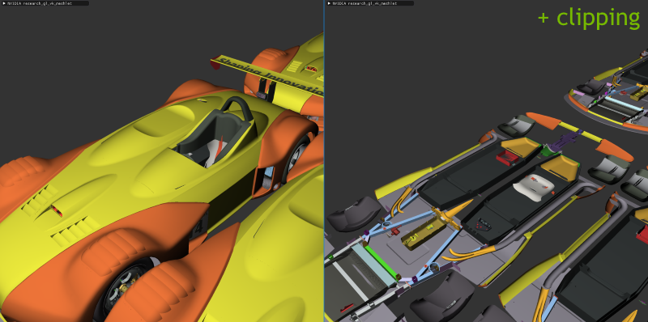
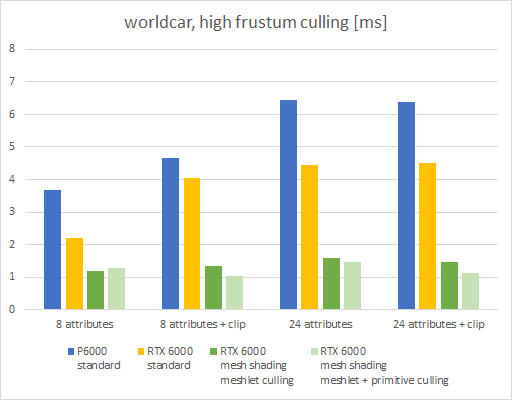
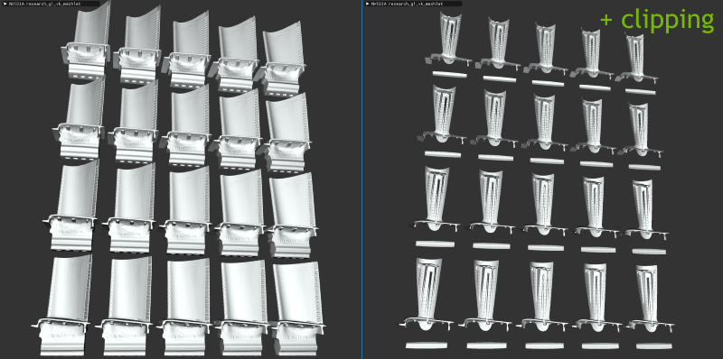
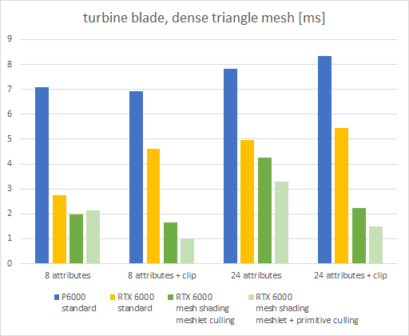

## Vulkan & OpenGL CAD Mesh Shader Sample

This sample demonstrates rendering of models with many triangles using mesh shaders. CAD models frequently have high triangle density and therefore the processing (vertex shading, primitive culling etc.) of the sheer number of primitives can become a challenge. With the [Turing architecture](https://www.nvidia.com/en-us/design-visualization/technologies/turing-architecture/) new shader stages have been introduced that allow a new geometry pipeline based on mesh shading. 

### Introduction


The new pipeline, as shown above, is explained in further detail in this [blog post](https://devblogs.nvidia.com/introduction-turing-mesh-shaders/). We highly recommend going through that material first.

> **Note** This sample currently builds two executables: gl_vk_... has both GL and Vulkan within the same GL window using a NVIDIA extension, the vk_... one uses WSI and pure Vulkan. There is also a cmake build option to remove the gl_vk_ exe and build the only the vk_ exe. For Vulkan it is recommanded to use the Vulkan stand-alone exe for Vulkan performance investigation and debugging.

### Sample Overview

The sample comes with two datasets:
* *worldcar* CAD model courtesy of [PTC](https://www.ptc.com). 
* *turbine blade* 3d scan model courtesy of [Georgia Institute of Technology](https://www.cc.gatech.edu/projects/large_models/).
Pass one of the `cfg` config files as commandline argument to load either model configuration. Both configurations will instance the model a few times to generate some meaningful workloads for benchmarking.

The ui allows you to use different renderers and compare between the classic and the mesh shading pipeline. There are also various tweakable options to see the performance impact of many different configurations.

You can toggle between vsync via *V* key (default is on for debug builds) and via *R* reload the shaders (they must be error-free).

> **NOTE:** Please read the performance section later for further details, as "your milage may vary". 

##### Basic Settings
- **renderer:** Switch between standard or mesh shading, see renderers section further below.
- **viewpoint:** Switch between some pre-configured camera viewpoints.
- **min. task meshlets:** Mesh renderers use task *and* mesh stages, if the amount of meshlets per drawcall is greater or equal than this, otherwise they use only the mesh stage.
- **(mesh) colorize by meshlet:** Visualize the triangle clusters in the fragment shader. Only works in mesh renderers.
- **use backface culling:** Impacts fixed function as well as culling performed in task or mesh stages.
- **show meshlet bboxes:** Draws the bounding boxes used by task-shader culling.
- **show meshlet normals:** Draws the cone normals used by task-shader culling.
- **(show) culled:** Draws only the gizmos that were culled by task-shader.
- **fov:** Camera field of view.

##### Culling
- **(mesh) use per-primitive culling:** Enable per-primitive culling in the mesh shader, by setting  `USE_MESH_SHADERCULL` flag in `drawmeshlet.mesh.glsl`. (does not cull based on user clipping plane).
- **use clipping planes:** Enables three clipping planes. This means we also increase the number of per-vertex outputs. 
- **clip position:** Relative coordinate of the clipping planes along each major axis.
- **(task) pixel cull:** Influence how aggressive the subpixel cluster culling in the task-shader should be performed. 1 means the full resolution is used, 0.5 means we may cull clusters that are actually visible, but often not noticeable. 

##### Model settings
Ideally use numeric inputs as each modification will cause reloading the model, you can also pass many settings via commandline.
- **meshlet vertices:** Maximum number of unique vertices per meshlet (256 for this app)
- **meshlet primitives:** Maximum number of triangles per meshlet (256 for this app)
- **extra v4 attributes:** The shading in this sample is rather simple when it comes to vertex attributes as well as what is passed to the fragment shader. With this value you can add attributes to emulate the per-vertex cost of texture coordinates, tangents etc. Setting to zero means only one vec4 is loaded, which contains the vertex normal.
- **model fp16 attributes:** vertex positions and attributes are encoded as 16-bit floats (half).
- **model copies:** Clone the model multiple times (geometry memory is re-used).

##### Framebuffer
- **superresolution:** Emulate larger window resolutions or downsampling, by increasing the actual rendered resolution using this factor. The quality of the downsampling was neglected here, so values beyond 4x don't look better. It can also be useful to investigate subpixel culling.

##### Statistics
- Render Time GPU: The time in milliseconds the rendering step took (excludes ui, blitting etc.).
- Original Index Size: Size of the original index buffer data.
- Meshlet Size: Size of all meshlet data that replaces the index buffer.
- **generate stats:** Lists various statistics generated in mesh shading. Can cost a bit of rendering performance. (resize ui window when activating or scroll down)
  - *task total:* Number of task shader workgroups (each handles up to 32 meshlets).
  - *mesh total:* Number of total meshlets in the scene.
  - *mesh output:* Number of meshlets processed by mesh shaders (second value is percentage).
  - *tri total:* Number of total triangles in the scene.
  - *tri output:* Number of triangles output by mesh shader (second value is percentage).
  - *vert input:* Number of position vertices read by mesh shader.
  - *attr read:* Number of attribute vertices read by mesh shader (second value is percentage). Can be lower than previous value if per-primitive culling is active, as then the mesh shader will skip loading culled attributes.


## Meshlet Building

In this sample we provide a basic implementation to generate primitive clusters, aka **meshlets** from regular index buffers.  The meshlet data is used by the `drawmeshlet.*.glsl` shaders to draw the model in the appropriate renderers.


The following diagram illustrates the principle data structures that replace the original triangle index buffer. When rendering with the mesh shaders we use these three buffers, instead of the classic index buffer.


Inside the sample you will find one meshlet builder in the `nvmeshlet_array.hpp` file, which scans an index buffer and builds the above data structures as CPU arrays.

The new default builder is within `nvmeshlet_packbasic.hpp` which combines primitive and vertex indices interleaved in a single buffer range and does an automatic 16 or 32 bit encoding. This also means we only need a single offset, rather than two, giving us more bits to play with.

These builders are used in the cadscene loader, look for `CadScene::buildMeshletTopology` inside `cadscene.cpp`.  Generating the data can take a bit time on the CPU, but is only done once and accelerated via OpenMP. 

At the end of the building process some statistics are printed to the console:
````
meshlet config: 64 vertices, 84 primitives
meshlets;   37023; prim;   2328141; 0.72; vertex;   2320072; 0.93; backface; 0.41; waste; v; 0.01; p; 0.08; m; 0.00
meshlet total: 37023
````
- meshlets: total number of meshlets
- prim: total number of triangles, followed by average utilization (e.g. here 72% means the typical meshlet has `84 * 0.72 = 60` triangles
- vertex: total number of unique vertices within meshlets, followed by average vertex utilization
- backface: percent of meshlets that support backface cluster culling (their normals are somewhat coherent)
- waste: percentage of additional memory cost per primitive, vertex or meshlet, due to alignment as defined by `PRIMITIVE/VERTEX_PACKING_ALIGNMENT` or additional padding.

This data is later used by the API specific versions of the cadscene loader (`cadscene_vk.cpp`and `cadscene_gl.cpp`), which generate the appropriate GPU resources.
You will see that to avoid creating tons of buffers/textures a basic chunked allocation scheme is employed via `GeometryMemoryVK/GL`.

In Vulkan the descriptorsets are generated and filled in `ResourcesVK::initScene` inside `resources_vk.cpp`.

In OpenGL we use bindless resources to do something similar to Vulkan's descriptors. Here a UBO is used that stores the bindless handles to the buffers and textures, it is equivalent to the *DSET_GEOMETRY* descriptorset.
The code showcases two scenarios: with and without `USE_PER_GEOMETRY_VIEWS` enabled (set in `config.h`). Disabling is faster and maximizes the use of the chunked allocations. We do less binds as our drawcalls are sorted by chunks, and we also need to create less dedicated resources that way (less buffer views). Instead we pass the offsets into the chunks as push_constant or glUniform. Two binding sets per chunk are created, as the chunk could either be used with 16-bit or 32-bit vertex indices.

## Renderers

Upon renderer activation the scene is traversed and encoded into a list of "drawitems", which are sorted once to minimize state changes.

- **GL**: OpenGL 4.x featureset, basic renderloop. 
- **VK**:  Vulkan 1.x featureset, secondary commandbuffer is built once, and replayed during rendering.
- **standard**: Implements a typical drawing loop, which executes vertex & fragment shading (`draw.*.glsl`) and uses `glDrawElementsBaseVertex / vkCmdDrawIndexed` to draw the model.
- **mesh**: Uses the new mesh and task shaders (`drawmeshlet.*.glsl`) and draws via `glDrawMeshTasksNV / vkCmdDrawMeshTasksNV` (watch for the different argument ordering between GL and VK).
- **nvbindless**: (only OpenGL) uses `glBufferAddressRangeNV` to reduce CPU drawcall validation time by providing resources via native GPU addresses.

## Performance

### IMPORTANT NOTES

**Preliminary Results**: At the time when the measurements were taken, the feature is still new and performance can therefore change in later releases. Always benchmark with your own datasets, target hardware and shading complexity for decision making. Feel free to contact us, if you encounter incoherent performance behavior.

**Vulkan / OpenGL**: Vulkan is currently a tad slower when used within the OpenGL context, this is a known issue. For best Vulkan performance use the `BUILD_<projectname>_VULKAN_ONLY` cmake option. Furthermore there is some known differences in the performance characteristics of this sample between the APIs, as the driver is continuously evolving, these differences may change in future.

**Scene-Dependent**: Due to the focus of this sample on faster primitive culling, the results shown below are very scene dependent. Changing the camera angle, clip plane positions etc. all have major influence on
the ratios of surviving triangles and vertices.

### Tested Scenarios

The rendering step was measured in milliseconds on Windows 10-64 bit with [NVIDIA Quadro](https://www.nvidia.com/en-us/design-visualization/quadro/) hardware. The rendering resolution was `2048x2048` (default settings).

| P6000    | RTX 6000 | RTX 6000 T                     | RTX 6000 TM                      |
|----------|----------|--------------------------------|----------------------------------|
| standard | standard | meshlets culled in task shader | meshlets culled in task shader   |
|          |          |                                | primitives culled in mesh shader |

We test the impact of a few configurations:
- **attributes:** Next to vertex position, this number of additional float 32-bit vertex attributes are loaded and passed to fragment shader. This is influenced by the "extra v4 attributes" value. When primitive culling is used, the mesh shader will avoid loading attributes of vertices that are not used. Next to the attributes listed here, the mesh shader will always ouput 4 fp32 position values for rasterization and 3 fp32 for lighting.
- **clipping:** Enables the three user clipplanes and disables backface culling. This adds implicit vertex outputs and allows more culling done in the task shader. Per-primitive culling in the mesh shader does not take the planes into account as we can assume most work is done in task shader for that. Both test scenes were prepared to cull roughly the same percentage in triangles when clipping is enabled.

### Vulkan Results
The vk only exe was used.

#### worldcar, high frustum culling



The scene contains nine cars, but the camera focuses on a single one, most others are fully outside frustum.
The total scene has 32 M triangles and 16 K drawcalls.

Most of the triangles in this model can use 16-bit indices, therefore our memory savings from the meshlet data structures
are not that much (14 vs 12 MB).

We use 16 "minimum meshlets" to make use of task stage. This gave best performance for this model as it
contains several drawcalls with very few meshlets that are quicker to process with a single stage.



| timing in [ms]                      | P6000 | RTX 6000 | RTX 6000 T | RTX 6000 TM |
|-------------------------------------|-------|----------|------------|-------------|
| 8 attributes                        |  3.68 |     2.19 |       1.20 |        1.29 |
| 8 attributes + clipping             |  4.65 |     4.04 |       1.34 |        1.02 |
| 24 attributes                       |  6.46 |     4.44 |       1.60 |        1.47 |
| 24 attributes + clipping            |  6.38 |     4.50 |       1.46 |        1.12 |
|                                     |       |          |            |             |
| **triangle output**                 |       |          |            |             |
| regular                             | 100 % |    100 % |       31 % |         5 % |
| clipping                            | 100 % |    100 % |       20 % |         2 % |

We can see that due to the high amount of triangles outside the frustum the task shader can cull a lot.
Per-primitive culling in the mesh shader may add more work than it saves for few attributes.

#### turbine blade, dense triangle mesh



This model is rendered as single drawcall per instance and uses 32-bit indices for vertex indices,
as a result we can save a good amount of memory (20 vs 10 MB) using meshlets.

There are 35 M triangles and 20 drawcalls in the total scene.



| timing in [ms]                      | P6000 | RTX 6000 | RTX 6000 T | RTX 6000 TM |
|-------------------------------------|-------|----------|------------|-------------|
| 8 attributes                        |  7.08 |     2.74 |       1.97 |        2.14 |
| 8 attributes + clipping             |  6.93 |     4.61 |       1.65 |        1.03 |
| 24 attributes                       |  7.83 |     4.97 |       4.27 |        3.31 |
| 24 attributes + clipping            |  8.34 |     5.46 |       2.25 |        1.50 |
|                                     |       |          |            |             |
| **triangle output**                 |       |          |            |             |
| regular                             | 100 % |    100 % |       70 % |        21 % |
| clipping                            | 100 % |    100 % |       20 % |         8 % |

This dataset shows us that the Quadro with Turing architecture does much better with 32-bit index usage
and high triangle density than the previous architecture in the standard renderer.
Another observation is that with more subpixel triangles and higher attribute usage, the
mesh shader per-primtive culling can win us almost a full millisecond.
Since there is no frustum culling in this scene (all blades visible), the clipping effect has
a big impact on the rendering performance.

### Performance Conclusion

The impact of mesh/task shaders depends on various factors:
- culling potential (cluster or per-primitive)
- meshlet packing and utilization (cluster culling properties, but also vertex re-use etc.)
- number of per-vertex and per-attribute outputs

In general however, one can see that in scenarios with dense geometry, mesh shaders always provide benefits compared to the traditional pipeline, and sometimes those can be substantial.
Furthermore we can see that the Turing Quadro performs significantly better when rendering dense meshes with the traditional pipeline as well.

You may achieve greater gains by custom packing of vertex and index data and further reducing memory bandwidth.

### Task Shader Overhead

Whenever there is multiple stages evolved, the hardware has to load balance creating warps for the different stages. When there is very little work per drawcall, adding more stages at the top can impact performance negatively on current hardware. As a result we only use the task shader where there were more than 16 meshlets per drawcall (empiric threshold).

The other option (not yet used in this sample) is to batch drawcalls with few meshlets into bigger drawcalls, so that the task shader stage becomes more effective again. Task shaders can serve as alternative to instancing/multi-draw-indirect as they can dispatch mesh shaders in a distributed matter.

Especially in models with many small objects, such a technique is highly recommeded (e.g. low-complexity furniture/properties in architectural visualization, nuts and bolts, guardrails etc.)

We can easily batch 32 small drawcalls into a single drawcall by summing the task counts over all batched drawcalls.

```` cpp
// batchWorkGroupSizesInclusive[] contains inclusive add over all task counts
// in the batched drawcalls (up to 32). This array is also provided as SSBO.
// Launch total sum of batched draws.
glUniform1ui(0, numBatchedDraws);
glDrawMeshTasksNV(0, batchDrawCountsInclusive[numBatchedDraws-1]);

````

Inside the first shader stage we use warp (subgroup) intrinsics to find which actual sub-drawcall we are in.

```` cpp
// instead of classic gl_DrawID or gl_InstanceID providing an identifier
// of the drawcall within a batch, we derive it from gl_WorkGroupID

layout(location=0) uniform uint numBatchedDraws;

layout(...) buffer batchSizesBuffer {
  uint batchDrawCountsInclusive[];
  // at least [numBatchedDraws]
  // contains inclusive add over all batched draw counts
}

uint getDrawID()
{
  uint drawID = 0;
  {
    // We perform the search _not_ as "vertical" for-loop over the elements in the array
    // (this would cause only one thread to do effective work),
    // but "horizontal" across the thread. A single operation in the warp
    // compares against all relevant values.

    const uint idx = min(gl_LocalInvocationID.x, numBatchedDraws - 1);
    uvec4 mask = subgroupBallot(gl_WorkGroupID.x < batchDrawCountsInclusive[idx]);
    // the lowest bit provides the thread invocation that "first" hit the true case in the comparison.
    drawID = subgroupBallotFindLSB(mask);
  }

  return drawID;
}

````

At the cost of some additional latency you can extend this to a total of `32 * 32` batched drawcalls, by doing the search in two iterations (first compare against every 32th element, then the subrange).

## Building
Make sure to have installed the [Vulkan-SDK](http://lunarg.com/vulkan-sdk/) (1.1.85.0 or higher). Always use 64-bit build configurations.

For best Vulkan performance use the vk exe (starting with vk_). If you are not interested in building the OpenGL & Vulkan combined exe then use the `BUILD_<projectname>_VULKAN_ONLY` cmake option.

Ideally, clone this and other interesting [nvpro-samples](https://github.com/nvpro-samples) repositories into a common subdirectory. You will always need [nvpro_core](https://github.com/nvpro-samples/nvpro_core). The nvpro_core is searched either as a subdirectory of the sample, or one directory up.

CMake will also download the required model files (`.csf.gz`) hosted on nvidia.com.

## Running
Pass one of the `*_meshlet.cfg` files as commandline argument (full path) as startup argument.
